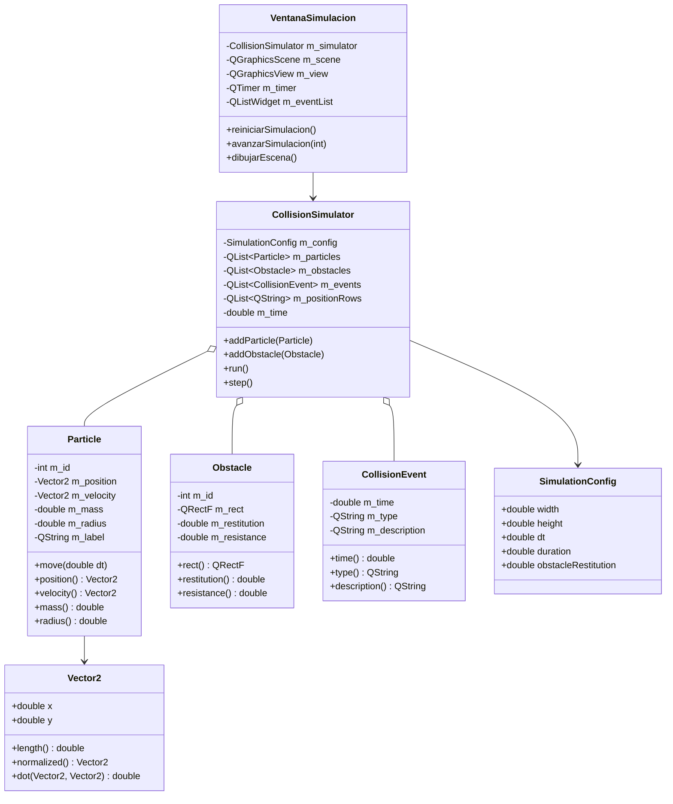

# Diagrama de clases

```mermaid
classDiagram
    class Vector2 {
        +double x
        +double y
        +length() double
        +normalized() Vector2
        +dot(Vector2, Vector2) double
    }

    class Particle {
        -int m_id
        -Vector2 m_position
        -Vector2 m_velocity
        -double m_mass
        -double m_radius
        -QString m_label
        +move(double dt)
        +position() Vector2
        +velocity() Vector2
        +mass() double
        +radius() double
    }

    class Obstacle {
        -int m_id
        -QRectF m_rect
        -double m_restitution
        -double m_resistance
        +rect() QRectF
        +restitution() double
        +resistance() double
    }

    class CollisionEvent {
        -double m_time
        -QString m_type
        -QString m_description
        +time() double
        +type() QString
        +description() QString
    }

    class SimulationConfig {
        +double width
        +double height
        +double dt
        +double duration
        +double obstacleRestitution
    }

    class CollisionSimulator {
        -SimulationConfig m_config
        -QList~Particle~ m_particles
        -QList~Obstacle~ m_obstacles
        -QList~CollisionEvent~ m_events
        -QList~QString~ m_positionRows
        -double m_time
        +addParticle(Particle)
        +addObstacle(Obstacle)
        +run()
        +step()
    }

    class VentanaSimulacion {
        -CollisionSimulator m_simulator
        -QGraphicsScene m_scene
        -QGraphicsView m_view
        -QTimer m_timer
        -QListWidget m_eventList
        +reiniciarSimulacion()
        +avanzarSimulacion(int)
        +dibujarEscena()
    }

    Particle --> Vector2
    CollisionSimulator o-- Particle
    CollisionSimulator o-- Obstacle
    CollisionSimulator o-- CollisionEvent
    CollisionSimulator --> SimulationConfig
    VentanaSimulacion --> CollisionSimulator
```

Este diseno separa el motor fisico de la visualizacion. `VentanaSimulacion` llama `CollisionSimulator::step()` desde un `QTimer` y dibuja cada `Particle` en la escena de Qt.
