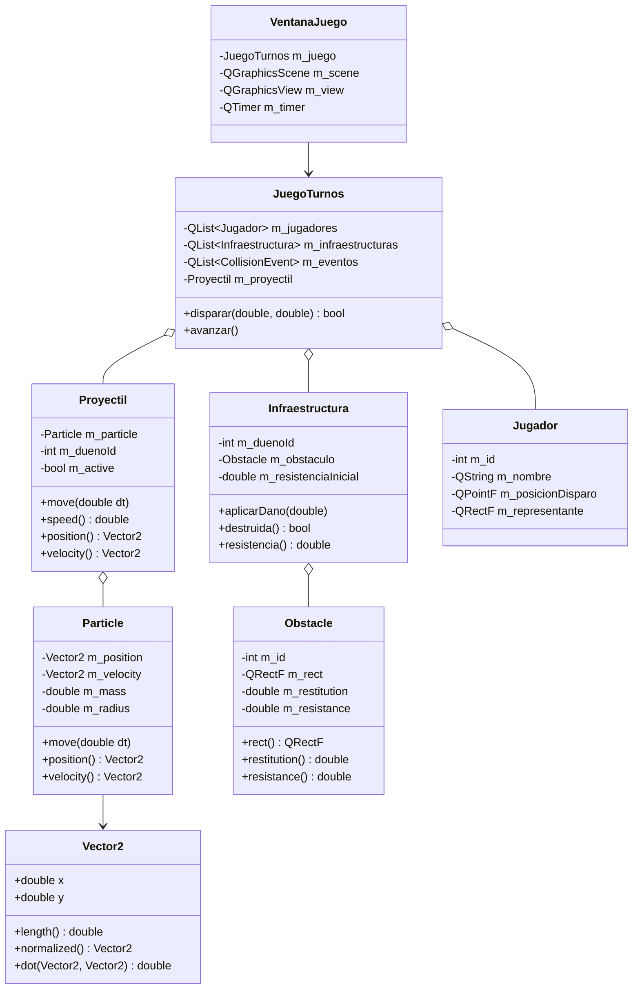

# Diagrama de clases - Modulo 2

```mermaid
classDiagram
    class Vector2 {
        +double x
        +double y
        +length() double
        +normalized() Vector2
        +dot(Vector2, Vector2) double
    }

    class Particle {
        -Vector2 m_position
        -Vector2 m_velocity
        -double m_mass
        -double m_radius
        +move(double dt)
        +position() Vector2
        +velocity() Vector2
    }

    class Obstacle {
        -int m_id
        -QRectF m_rect
        -double m_restitution
        -double m_resistance
        +rect() QRectF
        +restitution() double
        +resistance() double
    }

    class Proyectil {
        -Particle m_particle
        -int m_duenoId
        -bool m_active
        +move(double dt)
        +speed() double
        +position() Vector2
        +velocity() Vector2
    }

    class Infraestructura {
        -int m_duenoId
        -Obstacle m_obstaculo
        -double m_resistenciaInicial
        +aplicarDano(double)
        +destruida() bool
        +resistencia() double
    }

    class Jugador {
        -int m_id
        -QString m_nombre
        -QPointF m_posicionDisparo
        -QRectF m_representante
    }

    class JuegoTurnos {
        -QList~Jugador~ m_jugadores
        -QList~Infraestructura~ m_infraestructuras
        -QList~CollisionEvent~ m_eventos
        -Proyectil m_proyectil
        +disparar(double, double) bool
        +avanzar()
    }

    class VentanaJuego {
        -JuegoTurnos m_juego
        -QGraphicsScene m_scene
        -QGraphicsView m_view
        -QTimer m_timer
    }

    Particle --> Vector2
    Proyectil o-- Particle
    Infraestructura o-- Obstacle
    JuegoTurnos o-- Jugador
    JuegoTurnos o-- Infraestructura
    JuegoTurnos o-- Proyectil
    VentanaJuego --> JuegoTurnos
```

El modulo 2 reutiliza clases de la parte 1 por composicion, no por herencia: `Proyectil` contiene un `Particle` e `Infraestructura` contiene un `Obstacle`.
